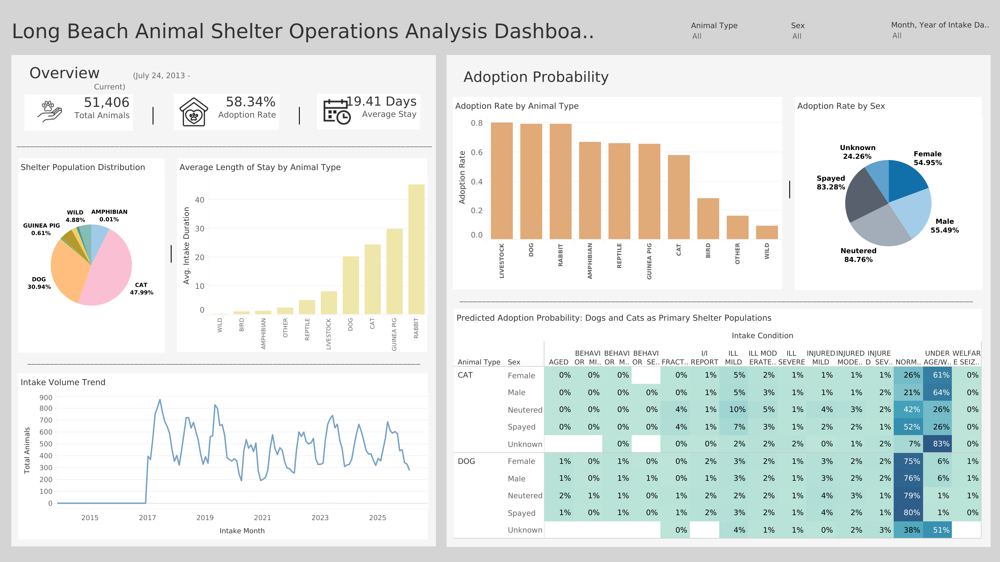

# Long Beach Animal Shelter Operations Analysis and Adoption Probability Prediction

## Executive Summary
This project explores animal shelter in Long Beach and surrounding areas' operations using SQL, Python, and Tableau to assess adoption rates and uncover major factors of animal outcomes. The study demonstrates significant variation in adoption rates and length of stay among animal species and intake circumstances, suggesting operational bottlenecks and areas for improvement.
A logistic regression model was created to predict adoption rates based on animal species, gender, and intake condition. The results demonstrate significant disparities: neutered or spayed dogs under age or weight had estimated adoption rates of over 99%, but cats with unknown sex, medical or behavioral difficulties have odds of less than 1%. This demonstrates that intake condition and animal type are the key factors influencing adoption results.

## Operation Problem
Animal shelters face limited capacity and resource constraints, yet adoption likelihood varies significantly across animal types and intake conditions. Without predictive insights, shelters cannot efficiently prioritize high-risk animals or optimize adoption strategies.

## Methodlogy
- **SQL (Data Engineering & KPI Development)**: Extracted and transformed over 50,000 shelter records to create structured analytical datasets, engineered key metrics such as Adoption Rate and Live Release Rate, and performed grouped aggregations to evaluate operational performance by animal type, sex, and intake condition.
- **Python (Predictive Modeling & Statistical Analysis)**: Created a **Logistic Regression Model** to estimate adoption probability based on animal features, evaluated differences across groups, and identified high-risk populations with much lower anticipated adoption likelihood.
- **Tableau (Visualization & Executive Reporting)**: Created interactive dashboards to track intake trends, outcome distributions, length of stay, and forecasted adoption risk, allowing for effective sharing of operational insights and data-driven decision-making.

## Tools and Technologies
- SQL: Data cleaning, aggregation, CASE statements, window functions
- Python: pandas, Numpy, scikit-learn, statistical testing, data preprocessing, feature engineering, Logistic Regression Modeling
- Machine Learning: Adoption Probability Prediction using Logistic Regression
- Tableau: Interative dashboards, calculated fields, trend visualization

## Key Skills Demonstrated
- End-to-End Data Analytics: Used SQL to clean data, create features, develop KPIs, and summarize results; developed predictive logistic regression models in Python to quantify adoption likelihood factors.
- Business Intelligence and Operational Strategy: Created interactive Tableau dashboards that turned statistical data into practical suggestions, increasing adoption efficiency and the utilization of resources.

## Results
- Adoption outcomes vary significantly across animal groups. Neutered or spayed dogs classified as under age or weight show predicted adoption probabilities near 99%, while cats with unknown sex or severe medical or behavioral conditions have probabilities below 1%, highlighting substantial disparities in adoption likelihood.
- Length-of-stay analysis identified operational bottlenecks among lower-probability groups, indicating increased resource utilization and reduced shelter capacity efficiency.
- The logistic regression model confirmed that animal type and intake condition are the strongest predictors of adoption outcomes, providing a quantitative framework for prioritizing medical treatment, behavioral intervention, and targeted marketing strategies.

## Impact
- Created a data-driven system to identify high-risk animal groups with low expected adoption rates, allowing for focused medical, behavioral, and marketing treatments to enhance adoption outcomes.
- Improved operational visibility by assessing adoption inequalities and length-of-stay bottlenecks, allowing for more effective resource allocation and shelter capacity planning.
- Delivered executive-level dashboards that convert predictive information into actionable KPIs, improving strategic decision-making and long-term adoption performance monitoring.
